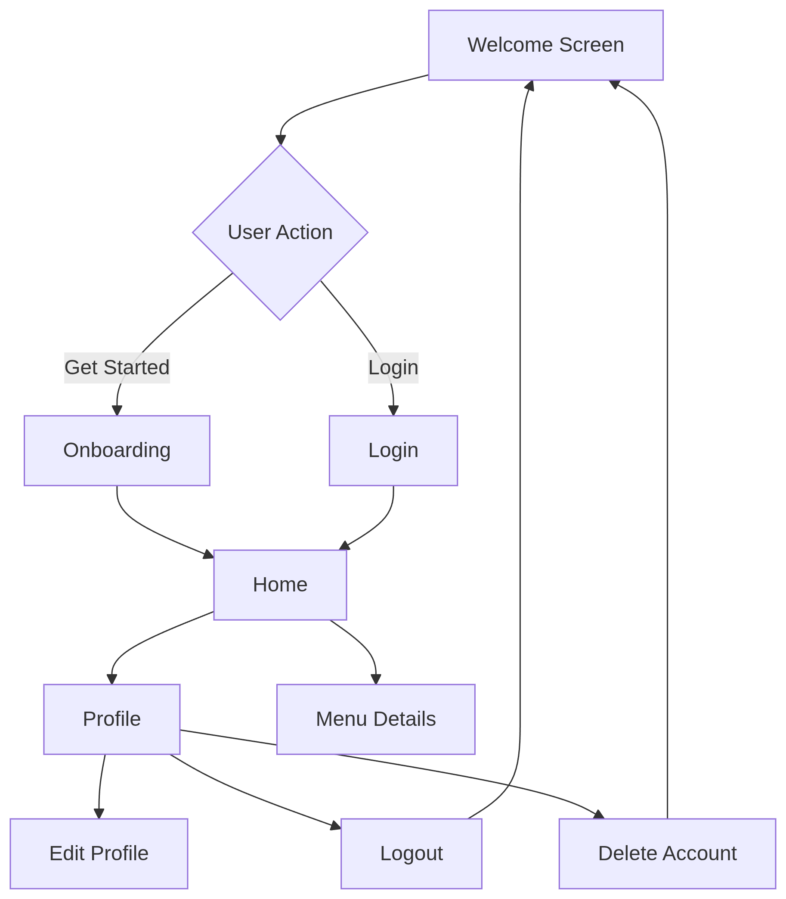

# LittleLemonGo 🍋
 **Little Lemon Restaurant App** 

**Final Project for Meta React Native Specialization on Coursera**

[](https://reactnative.dev/)
[](https://expo.dev/)
[](https://www.typescriptlang.org/)
[](https://formik.org)[](https://www.figma.com/design/5aTp5GF9yl0HG5X4APJOJX/LittleLemonGo?node-id=0-1&t=iWj6P0nGLbtsJHSR-1)

## Project Overview
This TypeScript-based application is the final project submission for the **Meta React Native Specialization** on Coursera. Built with React Native and Expo.

## Features ✨

- **User Authentication**
  - Secure signup with form validation
  - Login/logout functionality
  - Profile management
  - Account deletion option
- **Menu Browsing**
  - Category filtering (Starters, Mains, Desserts)
  - Search functionality
  - Menu item details view
- **User Experience**
  - Real-time profile synchronization
    (Avatar updates reflect instantly across all screens)
  - Personalized profile with avatar
  - Notification preferences
  - Smooth navigation between screens
- **Technical Features**
  - **Type-Safe Codebase** (TypeScript)
  - Offline data persistence (SQLite)
  - Persistent key-value storage (Async Storage)
  - Form management with Formik & Yup
  - Context API for state management
  - Animated UI feedback
  - Responsive design

## 📱 UI Wireframes
_Designed with Figma (Wireframes)_
```bash
/WireFrames directory
```
| Screen | Preview | Description |
|--------|---------|-------------|
| Welcome |  | Landing with auth options |
| Onboarding |  | Account creation flow |
| Login |  | Credential entry |
|Home|       |Menu browsing with search/filters|
|MenuItemsDetails|  |Dish information display
| Profile |  | User settings management |

> Wireframes focus on user flow and functionality rather than visual design details

## ▶️ Interactive Walkthrough
(https://www.canva.com/design/DAGrP02K6yU/wjHQQR1MMax_pNdEZBGPGw/watch?utm_content=DAGrP02K6yU&utm_campaign=designshare&utm_medium=link2&utm_source=uniquelinks&utlId=hf05d260251
"Click to play")
_Watch the 2:30 minutes flow demonstration_

## Installation Guide ⚙️

### Prerequisites
- Node.js v16+
- Expo CLI (`npm install -g expo-cli`)
- Android/iOS simulator or physical device

### Setup Instructions
1. Clone repository:
   ```bash
   git clone https://github.com/pro804/LittleLemonGo.git
   cd LittleLemonGo
2. Install dependencies
   ```bash
   npm install
3. Start development server
   ```bash
   expo start
4. Run on device/simulator
   ```bash
    # Press a for Android
    # Press i for iOS
    # Scan QR code with Expo Go app (physical device)
##  📊 App Flow Diagram



## 📚 Key Libraries Documentation

| Library | Version | Documentation |
|---------|---------|---------------|
| [React Navigation](https://reactnavigation.org) | v7.x | App navigation and routing |
| [Formik](https://formik.org) | 2.4.6 | Form state management |
| [Yup](https://github.com/jquense/yup) | 1.6.1 | Form validation schemas |
| [Expo SQLite](https://docs.expo.dev/versions/latest/sdk/sqlite/) | 15.2.12 | Local database storage |
| [React Native Reanimated](https://docs.swmansion.com/react-native-reanimated/) | 3.17.4 | Advanced animations |
| [Async Storage](https://react-native-async-storage.github.io/async-storage/) | 2.1.2 | Persistent key-value storage |

## TypeScript Implementation 🛠️

The project leverages TypeScript for:
- **Type-safe component props** with strict interfaces
- **Reduced runtime errors** through compile-time checks
- **Enhanced code maintainability** with explicit type definitions
- **Improved developer experience** through IntelliSense support

## Contributing  🤝
Pull requests welcome! For major changes, please open an issue first.


## 📝 License

This project is licensed under the [MIT License](./LICENSE).


